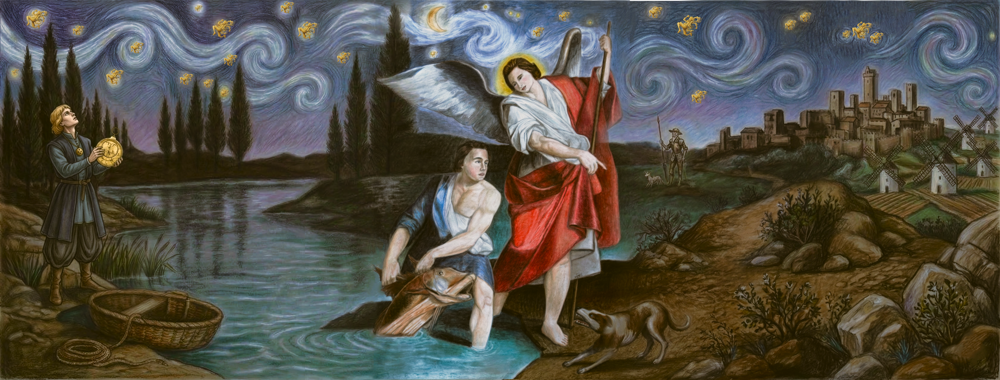

<!--
  PALETTE SLOTS — derived from assets/banner.png.
  Find & replace these hex codes (no "#") across this file to re-theme every widget:

    BG_COLOR ............ 0E1222   night-sky indigo, darkened
    PRIMARY_ACCENT ...... D9B54E   gold constellation stars / halo / astrolabe
    SECONDARY_ACCENT .... 86CAD6   river teal, lifted for dark-mode legibility
    TEXT_COLOR .......... E6EDF3   neutral readable text
-->

  

<h1 align="center">Philopateer Reda</h1>

  

  
  
  

<h2 align="center">About Me</h2>

I'm an Electronics &amp; Telecom Engineering student who treats signals, discrete math, and electronics as the foundation for everything I build in software.
That mindset shows up in my projects (readability analytics, image-segmentation pipelines, numerical solvers) and it's steering me toward NLP.
Right now I'm focused on local LLM inference: GGUF models served behind Django REST APIs and packaged with Docker.
I like work that goes from the math to a tool someone can actually use.

<h2 align="center">Tech Stack</h2>

  <b>Languages</b> 
  
  
  
  
  
  
   
  Python is my primary language.

  <b>NLP &amp; Applied AI</b> 
  
  
  
   
  Local GGUF LLM inference pipelines.

  <b>Backend &amp; Systems</b> 
  
  
  
  
  
  
  

  <b>Desktop GUI &amp; Tools</b> 
  
  
  

  <b>Scientific, Math &amp; Computer Vision</b> 
  
  
  
  

<h3 align="center">Currently Exploring</h3>

  <i>Study areas, kept separate from the core stack above. Not claimed as production expertise.</i>

  <b>Frontend</b> (in progress) 
  

  <b>ML Foundations</b> (study &amp; fork basis) 
  
  
  

  <b>Physics &amp; Hardware</b> 
  
  

<h2 align="center">Featured Projects</h2>

Four flagship projects. Each links to its full repository.

<table>
  <thead>
    <tr>
      <th align="left" colspan="2">01 &nbsp;·&nbsp; <a href="https://github.com/philopateerreda/textAnalytics">textAnalytics</a></th>
    </tr>
  </thead>
  <tbody>
    <tr>
      <td width="32%" valign="top">
          
        <b>Stack</b> 
        <code>Python</code> <code>spaCy</code> <code>NLTK</code> <code>SQLite</code> <code>Docker</code> <code>Docker Compose</code>
      </td>
      <td valign="top">
        <em>Dual-engine text intelligence suite tracking vocabulary acquisition, linguistic complexity, and lexical density.</em>
        <ul>
          <li><b>Base pipeline:</b> Flesch-Kincaid readability, POS frequencies, and keyword density.</li>
          <li><b>Advanced pipeline:</b> spaCy lemmatization, NER extraction, and automated vocabulary delta detection.</li>
          <li><b>Persistence:</b> SQLite-backed history with automated backup routines.</li>
          <li><b>Delivery:</b> containerized with Docker and Docker Compose for reproducible runs.</li>
        </ul>
        <a href="https://github.com/philopateerreda/textAnalytics"><b>View repository →</b></a>
      </td>
    </tr>
  </tbody>
</table>

<table>
  <thead>
    <tr>
      <th align="left" colspan="2">02 &nbsp;·&nbsp; <a href="https://github.com/philopateerreda/BulletType_desktop">BulletType_desktop</a></th>
    </tr>
  </thead>
  <tbody>
    <tr>
      <td width="32%" valign="top">
         
          
        <b>Stack</b> 
        <code>Python</code> <code>PyQt / Tkinter</code> <code>SQLite</code>  
        <b>Web port (in progress)</b> 
        <code>React</code> <code>Vite</code>
      </td>
      <td valign="top">
        <em>Native touch-typing speed and accuracy training engine with local performance analytics.</em>
        <ul>
          <li><b>Profiles:</b> local user profile state management.</li>
          <li><b>Live metrics:</b> real-time WPM and accuracy tracking.</li>
          <li><b>History:</b> database-backed session history.</li>
          <li><b>Web port:</b> <a href="https://github.com/philopateerreda/unfinished-web-BType"><code>unfinished-web-BType</code></a> is the complementary React + Vite version, currently <b>in progress</b>.</li>
        </ul>
        <a href="https://github.com/philopateerreda/BulletType_desktop"><b>View repository →</b></a>
      </td>
    </tr>
  </tbody>
</table>

<table>
  <thead>
    <tr>
      <th align="left" colspan="2">03 &nbsp;·&nbsp; <a href="https://github.com/philopateerreda/2023CollegeJavaProject">2023CollegeJavaProject</a></th>
    </tr>
  </thead>
  <tbody>
    <tr>
      <td width="32%" valign="top">
          
        <b>Stack</b> 
        <code>Java</code> <code>Java Swing</code> <code>Microsoft SQL Server</code> <code>JDBC</code>
      </td>
      <td valign="top">
        <em>Desktop flashcard and quiz application employing spaced-repetition principles for geopolitical knowledge.</em>
        <ul>
          <li><b>Learning modules:</b> interactive flashcard-based study flow.</li>
          <li><b>Challenge mode:</b> timed multiple-choice rounds with custom countdown timers.</li>
          <li><b>Accounts &amp; scores:</b> user authentication and persistent scoreboards via JDBC.</li>
          <li><b>Screenshots:</b> see the <a href="https://github.com/philopateerreda/2023CollegeJavaProject/tree/HEAD/docs/images"><code>docs/images</code></a> folder in the repository.</li>
        </ul>
        <a href="https://github.com/philopateerreda/2023CollegeJavaProject"><b>View repository →</b></a>
      </td>
    </tr>
  </tbody>
</table>

<table>
  <thead>
    <tr>
      <th align="left" colspan="2">04 &nbsp;·&nbsp; <a href="https://github.com/philopateerreda/IEEEVictorees4">IEEEVictorees4</a> &nbsp;DjangoAPI: Text Processing Services</th>
    </tr>
  </thead>
  <tbody>
    <tr>
      <td width="32%" valign="top">
          
        <b>Stack</b> 
        <code>Python</code> <code>Django REST Framework</code> <code>llama-cpp-python</code> <code>Docker</code>
      </td>
      <td valign="top">
        <em>Enterprise-grade text analysis REST API featuring offline LLM summarization and structured scoring pipelines.</em>
        <ul>
          <li><b>Offline summarization:</b> multi-style GGUF summaries with hallucination-reduction context resets.</li>
          <li><b>Scoring &amp; NER:</b> dedicated endpoints for structured scoring and named-entity extraction.</li>
          <li><b>Reporting:</b> automated PDF and JSON report generation.</li>
          <li><b>Deployment:</b> containerized with production Dockerfiles.</li>
        </ul>
        <a href="https://github.com/philopateerreda/IEEEVictorees4"><b>View repository →</b></a>
      </td>
    </tr>
  </tbody>
</table>

<h2 align="center">Utility Builds &amp; Applied Math</h2>

<table>
  <tr>
    <td width="50%" valign="top">
      <h4><a href="https://github.com/philopateerreda/DIP-project">DIP-project</a></h4>
      Digital Image Processing
      
Dual segmentation pipelines featuring background subtraction, Otsu thresholding, and Watershed segmentation for adjacent objects, documented with a LaTeX academic report.

      
<code>OpenCV</code> <code>Otsu</code> <code>Watershed</code> <code>LaTeX</code>

    </td>
    <td width="50%" valign="top">
      <h4><a href="https://github.com/philopateerreda/discreteMathProj">discreteMathProj</a></h4>
      Discrete Math Toolkit
      
Dark-mode PyQt5 suite for binary relation properties, truth-table logical equivalence, and graph connectivity and cycle validation (BFS/DFS).

      
<code>PyQt5</code> <code>Logic</code> <code>Graph Theory</code>

    </td>
  </tr>
  <tr>
    <td width="50%" valign="top">
      <h4><a href="https://github.com/philopateerreda/numerical">numerical</a></h4>
      Numerical Analysis Suite
      
PyQt6 interactive workspace for root-finding algorithms (Newton-Raphson, Secant, Bisection) and polynomial interpolation (Lagrange, Newton divided differences).

      
<code>PyQt6</code> <code>Root-finding</code> <code>Interpolation</code>

    </td>
    <td width="50%" valign="top">
      <h4><a href="https://github.com/philopateerreda/PDFSlicer">PDFSlicer</a></h4>
      CLI utility
      
Lightweight command-line tool for automated chapter extraction and splitting from <code>TOC.json</code>, with page-offset compensation.

      
<code>CLI</code> <code>JSON</code> <code>PDF</code>

    </td>
  </tr>
</table>

<b>More builds: secondary, academic &amp; reference repositories</b>

 

- [**LingoChat**](https://github.com/philopateerreda/LingoChat): experimental chat interface for conversational language learning, built with Python and web templates.
- [**ElectromagneticFieldsProject**](https://github.com/philopateerreda/ElectromagneticFieldsProject): COMSOL Multiphysics simulations evaluating biosensors and capacitor electrostatic distributions.
- [**register_page**](https://github.com/philopateerreda/register_page) & [**Todo**](https://github.com/philopateerreda/Todo): vanilla web fundamentals practice.
- **Academic forks (reference only):** [`handson-ml3`](https://github.com/philopateerreda/handson-ml3), [`probabilityForComputerScientists`](https://github.com/philopateerreda/probabilityForComputerScientists), [`Digital-Image-Processing`](https://github.com/philopateerreda/Digital-Image-Processing).

<h2 align="center">GitHub Analytics</h2>

  
  

<h2 align="center">Current Focus</h2>

- **Local LLM inference:** tuning GGUF summarization pipelines with `llama-cpp-python`, covering context management, latency, and hallucination reduction.
- **React + Vite frontends:** finishing the web port of BulletType.
- **Dockerization:** packaging NLP services with production-ready Dockerfiles and Compose setups.
- **ML foundations:** working through scikit-learn, TensorFlow, and Keras via forked reference material (study, not production).

  

  Thanks for stopping by. Reach out via <a href="https://www.linkedin.com/in/philopateer-reda-054881202/">LinkedIn</a> or <a href="mailto:filopateerredakamel2004@gmail.com">email</a>.

